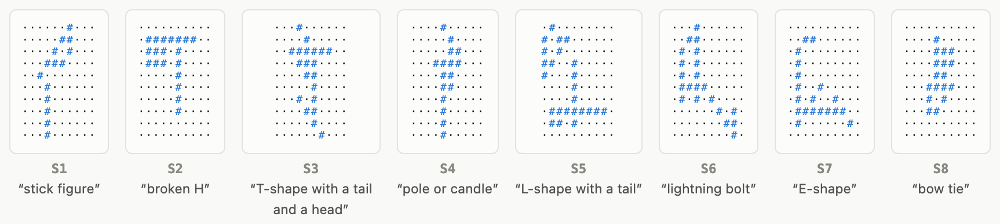
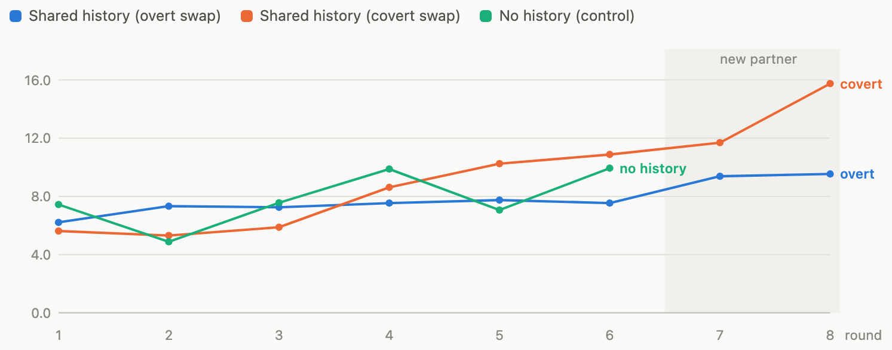
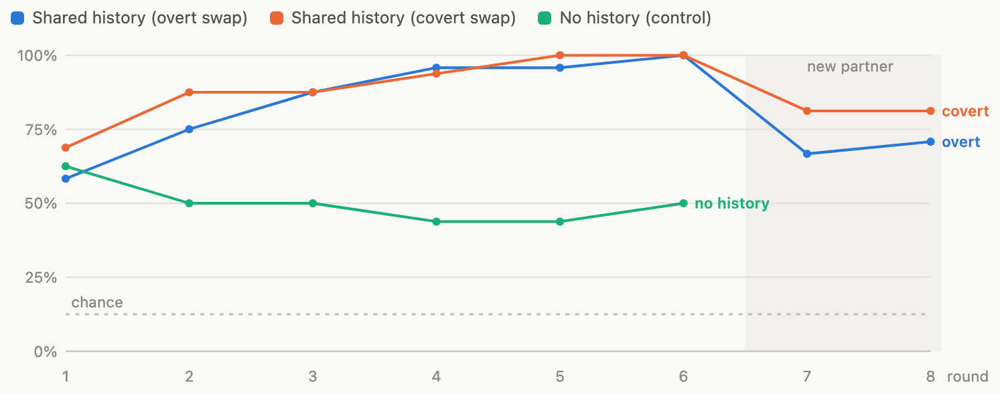
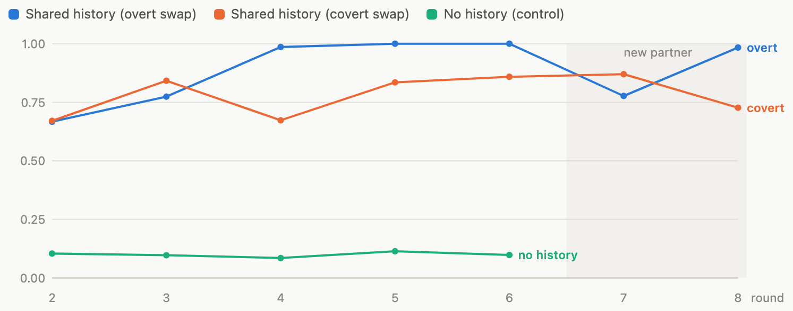
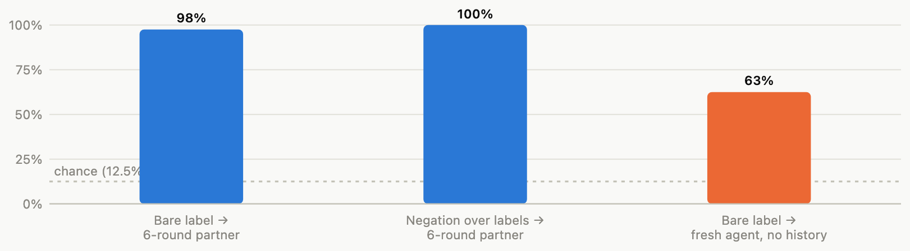

# Do LLM dyads form partner-specific conventions?

An iterated reference-game experiment testing three claims from Gregoromichelaki & Mills (2025),
*Process and Dynamics in AI and Language Use* (Topics in Cognitive Science):
that linguistic symbols are interaction-bound **constraints** rather than fixed form→meaning mappings;
that conventions formed in dialogue become detached, manipulable tokens (**"ungrounding"**);
and that in-context adaptation is where an LLM's "dynamics" live.

| | |
|---|---|
| **5/5** | shared-history dyads at 100% accuracy by round 6 (no-history control: ~50%, all rounds) |
| **100% → 72%** | accuracy when the partner is swapped (round 6 vs 7, Fisher exact p = 0.0004) |
| **98% vs 62%** | bare-label comprehension, 6-round partner vs fresh agent (39/40 vs 25/40, p = 1.2×10⁻⁴) |
| **20/20** | negation-over-labels probe trials correct ("neither the broken H nor the bow tie") |

A rendered report with interactive charts is in [`analysis/report.html`](analysis/report.html).

## The game

Two `gemini-2.5-flash` agents play the classic Clark & Wilkes-Gibbs (1986) tangram paradigm, text-only.
Eight abstract ASCII shapes; each round the **director** describes every shape once and the **matcher**
picks it from its own reshuffled, privately-lettered lineup. Grid reproduction, coordinates, and position
talk are forbidden; every word "costs". Both agents keep their full dialogue history — that history is
the only place a convention can live. After six rounds the matcher is **replaced by a fresh partner**
for two more rounds (director told: *overt*; not told: *covert*). A *no-history* control resets both
agents every round.

<picture>
  <source media="(prefers-color-scheme: dark)" srcset="figures/specimens_dark.png">
  
</picture>

*The eight stimuli, with the final labels one director settled on. S1, S4 and S7 are deliberately confusable.*

## Result 1 — No human-style compression: descriptions start terse and lengthen on failure

Human directors start near 20 words and compress round over round toward two-word conceptual pacts.
These directors, told that words cost, started terse (~6 words), then **lengthened on failure** and froze
whatever worked. Mean length stays flat or rises — the post-swap rise in the covert condition is
directors discovering the new partner through errors and repairing by elaboration.

<picture>
  <source media="(prefers-color-scheme: dark)" srcset="figures/words_dark.png">
  
</picture>

## Result 2 — Coordination improves, crashes on partner swap, re-forms

All five shared-history dyads reach 100% matcher accuracy by round 6; the no-history control never
escapes ~50%. Swapping in a partner who lacks the history knocks accuracy to 72% (p = 0.0004), and
feedback rebuilds it. Chance is 12.5%.

<picture>
  <source media="(prefers-color-scheme: dark)" srcset="figures/accuracy_dark.png">
  
</picture>

## Result 3 — Conventions stabilize lexically

Consecutive-round content-word overlap (Jaccard) for the same item approaches 1.0 — verbatim formula
reuse — versus ~0.10 when agents are reset each round. The convention-formation equilibrium is reached
by **form-freezing**, not gradual streamlining: stability without economy.

<picture>
  <source media="(prefers-color-scheme: dark)" srcset="figures/stability_dark.png">
  
</picture>

## Result 4 — The ungrounding probes

After round 8 the director wrote down its final label for each shape; three probes then reused those
labels in new instructions.

<picture>
  <source media="(prefers-color-scheme: dark)" srcset="figures/probes_dark.png">
  
</picture>

- **Bare label → 6-round partner**: the original matcher, which shares the full game history, resolves
  the labels almost perfectly (39/40).
- **Negation**: the same matcher picks "the one that is *neither* X *nor* Y" from a restricted 3-shape
  display — 20/20, so established labels immediately work as arguments of a logical operator they were
  never used with during the game.
- **Bare label → fresh agent**: an identical copy of the same model, seeing the same 8 shapes but none
  of the history, drops to 25/40.

Same weights, same labels, same referents — the missing 36 points live entirely in the shared transcript.

## How the conventions evolved

One item, one game (S6, baseline seed 102):

| Round | Description | Words | Outcome |
|---:|---|---:|---|
| 1 | "Vertical stick figure with a branching tail." | 7 | ✓ |
| 2 | "Vertical stick figure with a branching tail." | 7 | ✓ verbatim reuse begins |
| 3–6 | *(identical, verbatim)* | 7 | ✓✓✓✓ |
| 7 | "Tall, thin, central column with a wider middle and a branching, scattered bottom." | 13 | ✗ new partner announced — director re-expands, misses anyway |
| 8 | *(same 13-word formula)* | 13 | ✓ feedback re-stabilizes |

## Reading the results against the paper

**Symbols as interaction-bound constraints — supported.** The strongest fact in the data is a controlled
one: director and matcher are the *same frozen network*. Nothing that could count as a lexical convention
exists in the weights of one agent and not the other. Yet the same label scores 98% inside the dyad that
formed it and 62% outside it. Whatever the label's meaning-in-use is, it is stored in the shared
transcript — the paper's "coordinative structure" — not in either network. The usual human confound (two
different brains that might have internalized different things) is absent by construction.

**"Ungrounding" — partially observed.** Rączaszek-Leonardi asks how forms become *partly detached* "from
the ongoing stream of events so as to be amenable to rule-based manipulation." Operationalized here: once
a dyad has settled on "the lightning bolt", the token works under negation (20/20) — a manipulable
argument, not a frozen stimulus-response routine. But detachment is partial: transfer outside the dyad
stays 36 points below within-dyad use. Detached enough for logic, still tethered to the history that made it.

**Stability without economy — a real divergence from humans.** One reading: humans discover efficiency
interactively because verbatim recall of their own past descriptions is costly, so re-referring
compresses; an LLM re-reads its transcript for free, so the cheapest reliable move is exact repetition.
For LLMs, fidelity itself is the affordance.

**Audience design is inconsistent.** Told about the new partner, one director immediately re-expanded its
formulas; others kept 6-round-old shorthand with a partner who had never seen it. Adaptation was reliably
*reactive* (feedback-driven), rarely *anticipatory* (partner-model-driven) — matching the paper's
Beer-derived critique of adaptation bounded by the context window.

## Limitations

- Small scale: 7 games, 544 scored trials, one model, one 8-item stimulus set.
- One-shot protocol: the matcher cannot ask clarification questions, so incremental repair dynamics
  (DS-TTR-style) are excluded by design.
- Efficiency pressure is an instruction, not an objective; it produced terse openings rather than
  human-like compression curves.
- Fresh-agent transparency (62%) partly reflects that honest descriptions of ASCII shapes are
  semi-transparent to any competent viewer; the meaningful quantity is the 36-point within-dyad gap.
- Negation probes used a restricted 3-shape display (chance 33%).

## Instrument lessons (two archived bugs, both documented in `results/`)

1. **Strict answer parsing poisons interaction experiments.** The matcher drifts into `$\boxed{B}$` /
   "final answer is B" formats; scoring those as wrong creates false negative feedback → the director
   elaborates → the matcher drifts further (one run-1 game spiraled to 47-word descriptions and 19%
   accuracy). Fix: tolerant parser + one instrument-level format re-ask. See `results/run1_probebug/`
   and `results/run2_parserbug/`.
2. **Letter-remapped displays must be re-shown at probe time.** A matcher probed after the game answered
   consistently under a stale round's letter mapping — errors formed clean permutations, which look like
   comprehension failure but aren't.

## Files

| Path | What |
|---|---|
| `stimuli.py` | 8 center-normalized abstract ASCII shapes (seeded generator) |
| `game.py` | Game engine: director/matcher agents, swap conditions, ungrounding probes |
| `run_all.py` | Full grid: 3× baseline (overt swap), 2× covert swap, 2× no-history |
| `analysis/analyze.py` | Tidy CSVs + stats summary |
| `analysis/make_report.py` | Injects data + `report_texts.json` into `report_template.html` |
| `analysis/export_figures.py` | Renders the report's charts to the PNGs in `figures/` |
| `results/` | Run-3 per-trial JSON + full agent transcripts |

## Reproducing

```bash
pip install google-genai pandas scipy
gcloud auth application-default login
export GOOGLE_CLOUD_PROJECT=<your-gcp-project>   # any project with Vertex AI enabled
python3 run_all.py        # skips games whose results JSON already exists
cd analysis && python3 analyze.py && python3 make_report.py
```

No credentials live in this repo: auth is Application Default Credentials, and the GCP project is read
from `GOOGLE_CLOUD_PROJECT`. ~1,600 model calls ≈ US$5.

## References

- Gregoromichelaki, E. & Mills, G. J. (2025). Process and Dynamics in AI and Language Use. *Topics in Cognitive Science*.
- Clark, H. H. & Wilkes-Gibbs, D. (1986). Referring as a collaborative process. *Cognition*.
- Wilkes-Gibbs, D. & Clark, H. H. (1992). Coordinating beliefs in conversation. *Journal of Memory and Language*.
- Hawkins, R. D., Kwon, M., Sadigh, D. & Goodman, N. D. (2020). Continual adaptation for efficient machine communication. *CoNLL*.
